<p align="center">
  <picture>
    <source media="(prefers-color-scheme: dark)" srcset="logo-light.png">
    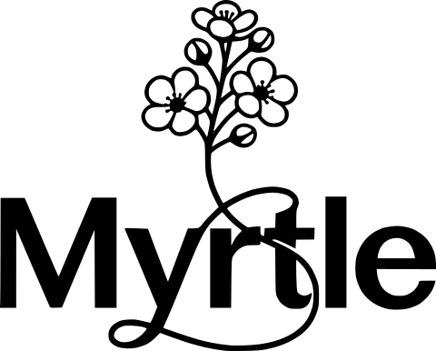
  </picture>
</p>

# 🌸 myrtle
Myrtle is a composable, strongly typed email content builder for Go.

| Default | Terminal |
| --- | --- |
| 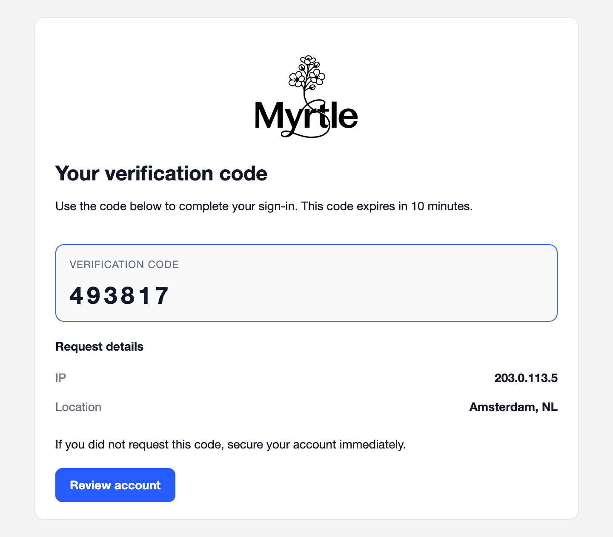 | 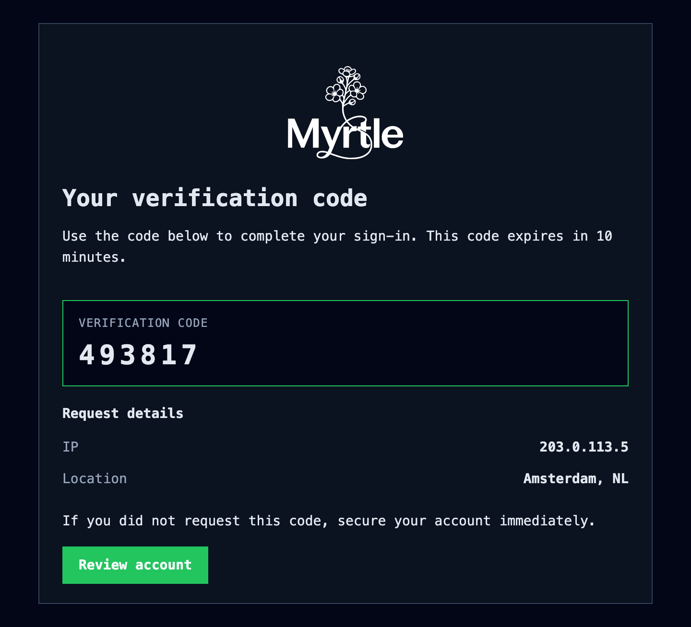 |

## Features

- Fluent builder pattern for email content.
- Strongly typed library of blocks.
- Modern built-in themes: `default`, `flat`, `terminal`, `editorial`.
- Built-in advanced blocks such as tables, charts, grids.
- High-impact blocks: timelines, standout stats rows, badges, attachments.
- Dual rendering APIs:
  - `HTML()` for final HTML output.
  - `Text()` for plain-text fallback output.
- Customizable and extensible: bring your own theme, styles or custom blocks.
- Left-to-right and right-to-left direction support (e.g. for Arabic/Hebrew).
- Renders OK in Outlook Classic and other notoriously difficult email clients.
- Dependency-free aside from [`goldmark`](https://github.com/yuin/goldmark) for Markdown rendering.

## Installation

```bash
go get github.com/gzuidhof/myrtle
```

## Quick start (security email)

```go
package main

import (
  "github.com/gzuidhof/myrtle"
  defaulttheme "github.com/gzuidhof/myrtle/theme/default"
)

func main() {
  email := myrtle.NewBuilder(defaulttheme.New()).
    WithPreheader("Use this one-time code to sign in").
    AddHeading("Your verification code").
    AddText("Use the code below to complete your sign-in. This code expires in 10 minutes.").
    Add(myrtle.VerificationCodeBlock{Label: "Verification code", Value: "493817"}).
    AddKeyValue("Request details", []myrtle.KeyValuePair{
      {Key: "IP", Value: "203.0.113.5"},
      {Key: "Location", Value: "Amsterdam, NL"},
    }).
    AddText("If you did not request this code, secure your account immediately.").
    AddButton("Review account", "https://example.com/account/security").
    Build()

  html, err := email.HTML()
  if err != nil {
    panic(err)
  }

  md, err := email.Text()
  if err != nil {
    panic(err)
  }

  // Use your favorite e-mail sending library to send the email with the generated HTML and text content.
  // ...

  _ = html
  _ = md
}
```

Make use of auto-complete/Intellisense in your IDE to explore the rich library of blocks and customization options.

## Expandable snippets

<details>
<summary><strong>Custom block (basic)</strong></summary>

```go
package main

import (
  "fmt"

  "github.com/gzuidhof/myrtle"
  "github.com/gzuidhof/myrtle/theme"
  defaulttheme "github.com/gzuidhof/myrtle/theme/default"
)

type DeploymentStatus struct {
  Service string
  Version string
  Status  string
}

func main() {
  block := myrtle.NewCustomBlock(
    theme.BlockKind("deployment_status"),
    DeploymentStatus{Service: "billing-api", Version: "v1.42.0", Status: "healthy"},
    func(v DeploymentStatus, values theme.Values) (string, error) {
      _ = values
      return fmt.Sprintf("<p><strong>%s</strong> on <code>%s</code>: %s</p>", v.Service, v.Version, v.Status), nil
    },
    func(v DeploymentStatus, context myrtle.RenderContext) (string, error) {
      _ = context
      return fmt.Sprintf("%s on %s: %s", v.Service, v.Version, v.Status), nil
    },
  )

  email := myrtle.NewBuilder(defaulttheme.New()).
    AddHeading("Deployment update").
    Add(block).
    Build()

  _, _ = email.HTML()
  _, _ = email.Text()
}
```

</details>

<details>
<summary><strong>Style tweaks (basic)</strong></summary>

```go
package main

import (
  "github.com/gzuidhof/myrtle"
  "github.com/gzuidhof/myrtle/theme"
  defaulttheme "github.com/gzuidhof/myrtle/theme/default"
)

func main() {
  styles := theme.DefaultDarkModeStyles()
  styles.ColorPrimary = "#22d3ee"
  styles.MaxWidthMain = "640px"
  styles.MainContentBodyTopSpacing = "0"

  email := myrtle.NewBuilder(
    defaulttheme.New(),
    myrtle.WithStyles(styles),
  ).
    WithPreheader("Theme overrides example").
    AddHeading("Style tweaks").
    AddText("This message uses a dark preset with a few token overrides.").
    AddButton("Open dashboard", "https://example.com/dashboard").
    Build()

  _, _ = email.HTML()
  _, _ = email.Text()
}
```

</details>

<details>
<summary><strong>Concurrent rendering with shared header/footer/theme/styles</strong></summary>

```go
package main

import (
  "sync"

  "github.com/gzuidhof/myrtle"
  "github.com/gzuidhof/myrtle/theme"
  defaulttheme "github.com/gzuidhof/myrtle/theme/default"
)

type RenderedEmail struct {
  To   string
  HTML string
  Text string
  Err  error
}

func main() {
  // Shared theme/styles/header/footer used to build one baseline builder.
  sharedStyles := theme.Styles{
    ColorPrimary: "#2563eb",
    MaxWidthMain: "640px",
  }

  sharedHeader := myrtle.NewGroup().
    AddImage("https://example.com/logo.png", "Myrtle", myrtle.ImageWidth(120), myrtle.ImageAlign(myrtle.ImageAlignmentCenter)).
    AddText("Security updates", myrtle.TextAlign(myrtle.TextAlignCenter), myrtle.TextWeight(myrtle.TextWeightSemibold))

  sharedFooter := myrtle.NewGroup().
    AddLegal(
      "Myrtle Inc.",
      "Dam Square 1, 1012 JS Amsterdam, Netherlands",
      "https://example.com/preferences",
      "https://example.com/unsubscribe",
    )

  baseBuilder := myrtle.NewBuilder(defaulttheme.New(), myrtle.WithStyles(sharedStyles)).
    WithHeader(sharedHeader).
    WithFooter(sharedFooter).
    WithPreheader("Important account security update")

  recipients := []string{"ana@example.com", "bo@example.com", "cy@example.com"}
  results := make([]RenderedEmail, len(recipients))

  var wg sync.WaitGroup
  for i, to := range recipients {
    wg.Add(1)
    go func(i int, to string) {
      defer wg.Done()

      // Clone the baseline builder and apply recipient-specific content.
      email := baseBuilder.Clone().
        AddHeading("Account alert").
        AddText("We detected a sign-in from a new location.").
        AddKeyValue("Recipient", []myrtle.KeyValuePair{{Key: "Email", Value: to}}).
        AddButton("Review activity", "https://example.com/security").
        Build()

      html, err := email.HTML()
      if err != nil {
        results[i] = RenderedEmail{To: to, Err: err}
        return
      }

      text, err := email.Text()
      results[i] = RenderedEmail{To: to, HTML: html, Text: text, Err: err}
    }(i, to)
  }
  wg.Wait()

  _ = results
}
```

</details>

## Examples

- [example/weekly_operations_brief.go](example/high_impact.go)
- [example/account_deletion_confirmation.go](example/account_deletion_confirmation.go)
- [example/security.go](example/security.go)
- [example/monster.go](example/monster.go)

### Rendered examples

#### Weekly operations brief

| Default | Flat |
| --- | --- |
| 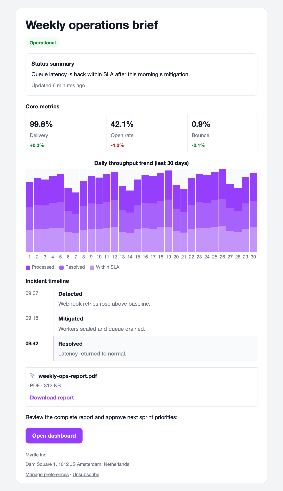 | 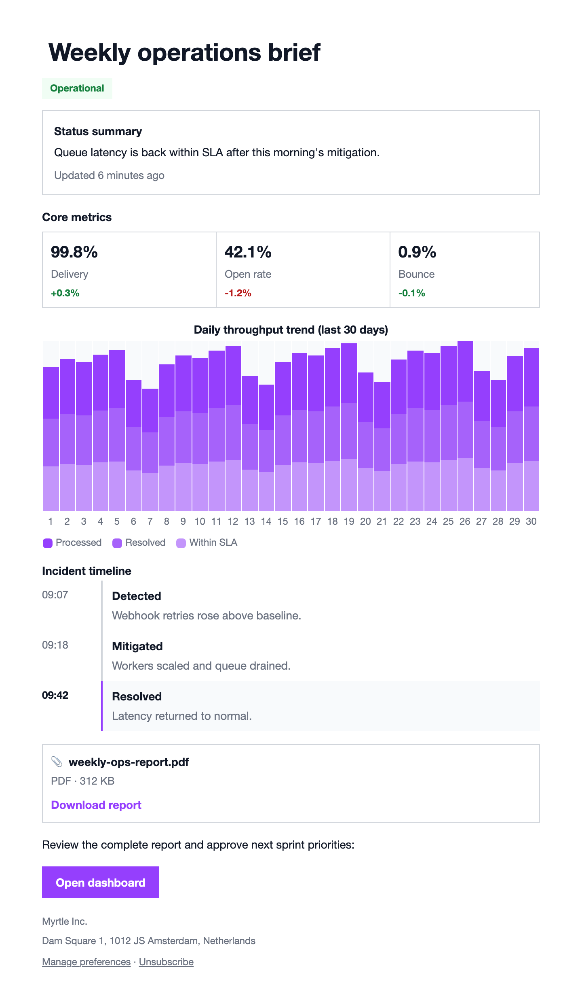 |
| Terminal | Editorial |
| 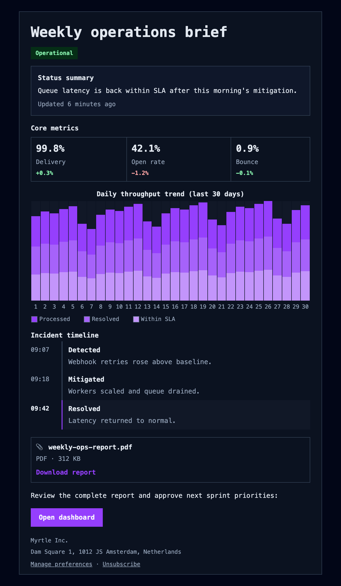 | 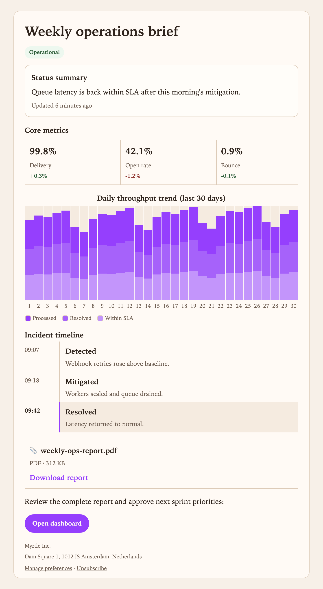 |

#### Account deletion confirmation

| Default | Flat |
| --- | --- |
| 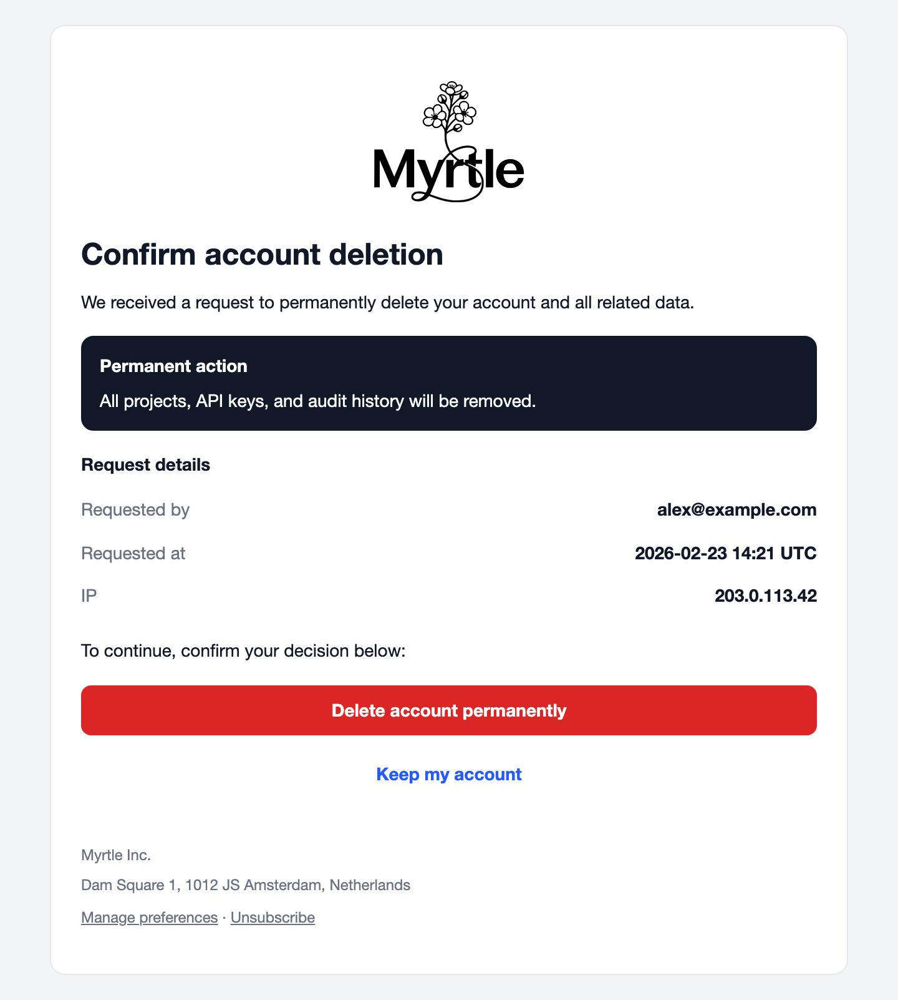 | 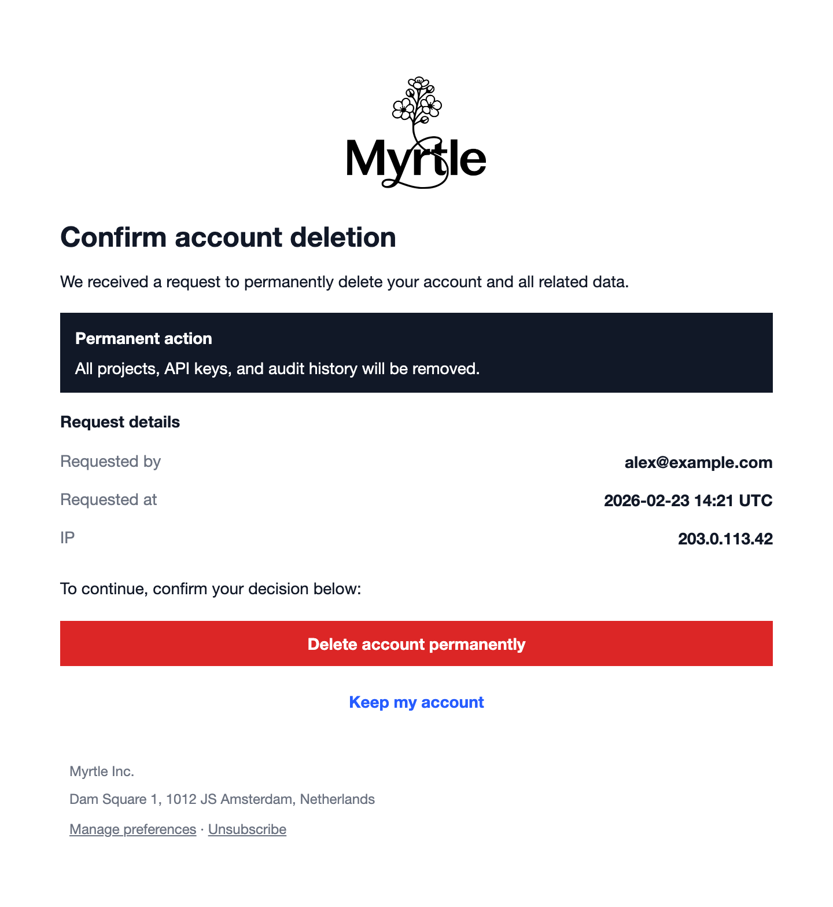 |
| Terminal | Editorial |
| 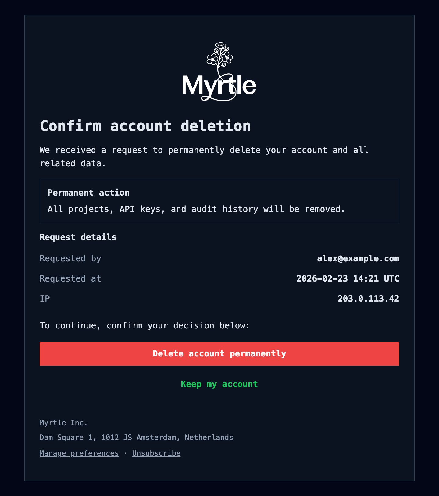 | 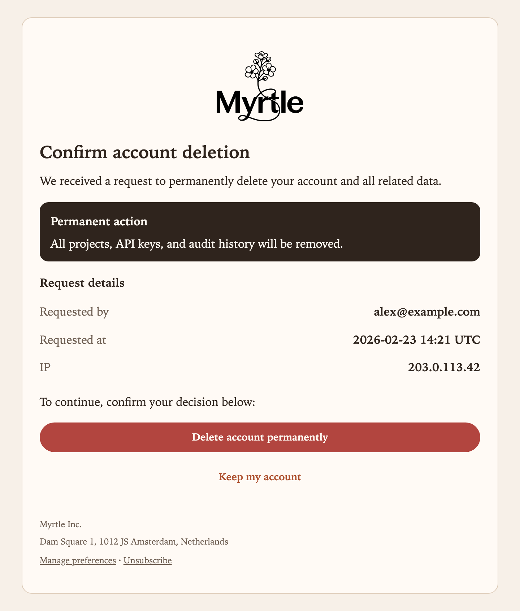 |

#### Security confirmation

| Default | Flat |
| --- | --- |
|  | 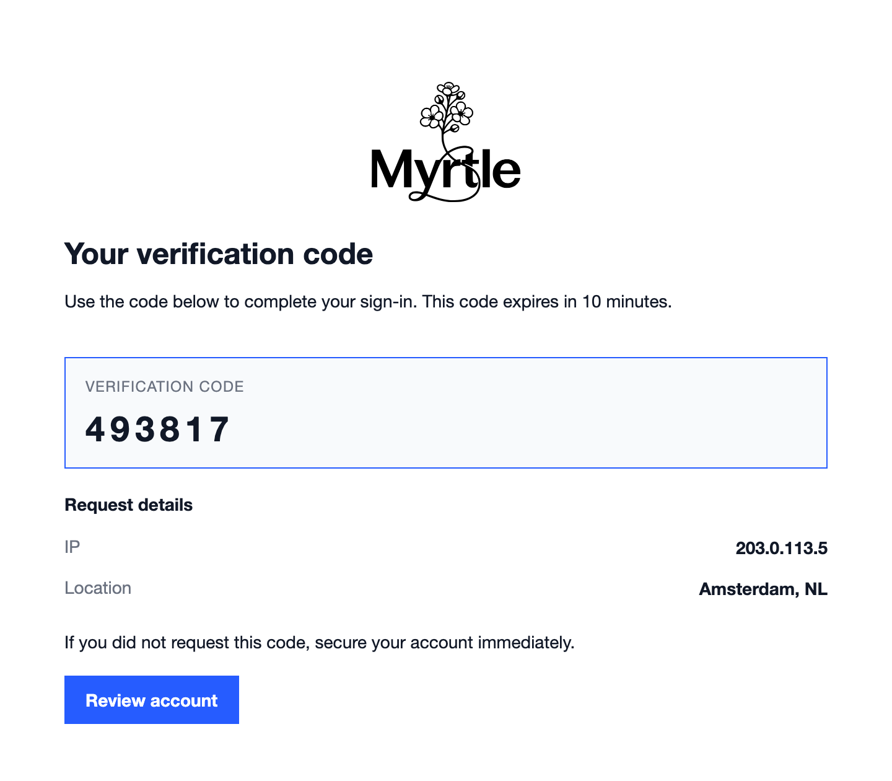 |
| Terminal | Editorial |
|  | 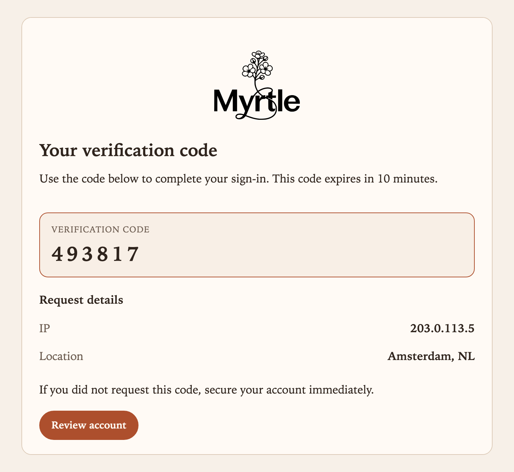 |

#### Monster

The monster example is a fun showcase of many blocks and styles together. It intentionally has a lot of content to demonstrate how the builder and themes handle it.

- [screenshots/default--monster.png](screenshots/default--monster.png)

## Example server

The [example/server](example/server) package serves a directory of all example emails and block previews.

Clone this repository and run the server to preview example emails in the browser at `http://localhost:8380/`.

```bash
go run ./example/server/cmd
```

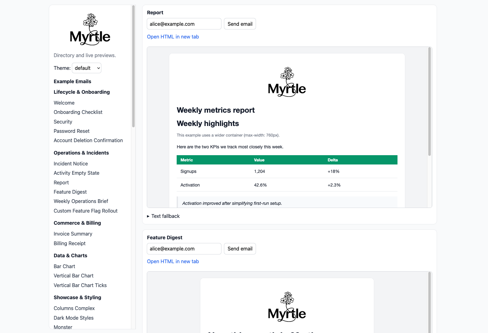

## Development
The code for this repository is repetitive and verbose, I recommend you use AI-assisted code generation to speed up development. Writing inlined CSS manually is particularly painful.

> Myrtle she wrote.
